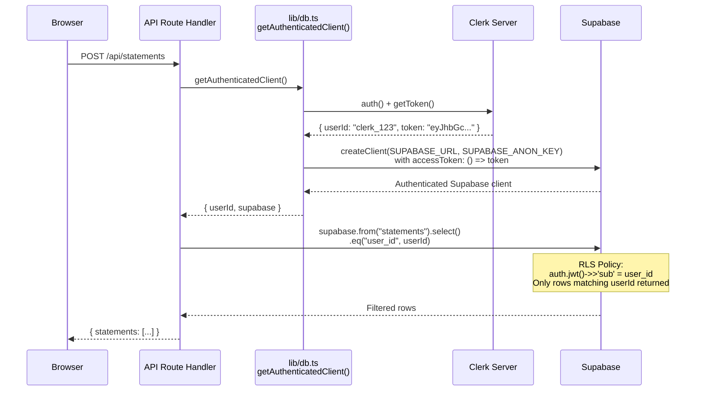
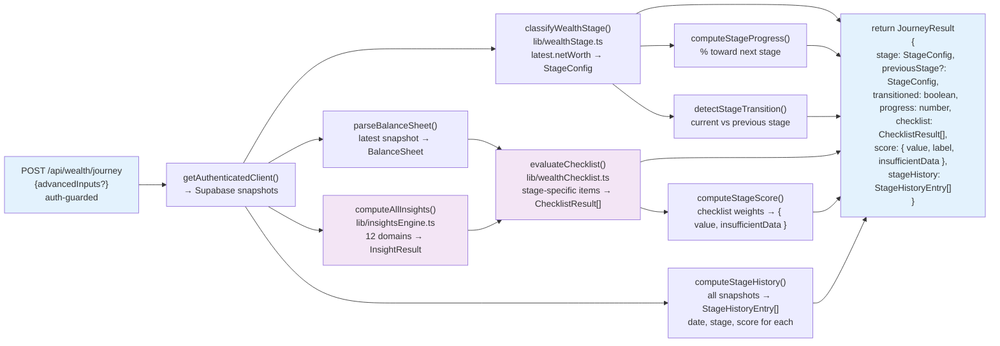

# Architecture

## System Overview

**Wealth Trek** is a personal balance sheet platform built as a Next.js 16 application. Users record assets and liabilities, generate net worth certificates, track trends over time, receive AI-powered financial guidance, and progress through a structured wealth journey based on their net worth stage. The platform uses Clerk for authentication, Supabase for data storage with Row-Level Security, OpenAI for AI-powered chat and document extraction, and Razorpay for subscription payments.

---

## Technology Stack

| Layer | Technology | Version | Purpose |
|---|---|---|---|
| **Framework** | Next.js (App Router) | 16.1.6 | SSR + API routes |
| **UI** | React | 19.2.3 | Component rendering |
| **Styling** | TailwindCSS | 4.x | Utility-first CSS with `@theme inline` |
| **Components** | shadcn/ui, Lucide icons, Framer Motion | — | Accessible UI + animations |
| **Charts** | Recharts | 3.8.x | Client-side data visualization |
| **Auth** | Clerk (`@clerk/nextjs`) | 7.x | Session management + pre-built UI |
| **Database** | Supabase (`@supabase/supabase-js`) | 2.x | PostgreSQL with Row-Level Security |
| **AI** | OpenAI SDK | 6.x | GPT-4o-mini (chat), GPT-4o vision (document extraction) |
| **Payments** | Razorpay | 2.9.x | Subscription processing + verification |
| **PDF Generation** | jsPDF + jspdf-autotable | 4.x / 5.x | Client-side net worth certificate |
| **PDF Extraction** | Python `pdfplumber` (subprocess) | ≥0.10 | Server-side bank statement parsing |
| **Testing** | Vitest + Playwright | 4.x | Unit, functional, and end-to-end tests |
| **Deployment** | Vercel | — | Serverless hosting |

---

## System Architecture

```mermaid
flowchart TB
  subgraph Browser ["Browser — Client (React 19 + TailwindCSS 4 + shadcn/ui)"]
    Pages["Dashboard Pages<br/>(use client)<br/>Snapshot · Analytics · Chat<br/>Goals · Wealth Tracker · Wealth Journey"]
    Hooks["Custom Hooks<br/>useStatements · useNetWorthHistory<br/>useFinancialGoals · useChatHistory<br/>useUserProfile · useAdvancedInputs<br/>useDocuments · useSubscription"]
    LocalStorage[("localStorage<br/>(documents only)")]
    ClerkUI["Clerk UI<br/>(SignIn, UserButton<br/>SessionProvider)"]
    
    Pages --> Hooks
    Hooks -->|fetch /api/...|NextAPI
    Hooks <--> LocalStorage
    Pages --> ClerkUI
  end
  
  subgraph NextJS ["Next.js Server (Node.js)"]
    Middleware["proxy.ts (Clerk middleware)<br/>Protects /dashboard/* routes<br/>Returns 307 redirect if unauthenticated"]
    AuthHelper["getAuthenticatedClient()<br/>lib/db.ts<br/>Retrieves Clerk JWT<br/>Creates Supabase client with token"]
    
    APIRoutes["API Routes (auth-guarded)<br/>/api/statements<br/>/api/snapshots<br/>/api/goals<br/>/api/profile<br/>/api/chat/messages<br/>/api/advanced-inputs<br/>/api/subscription<br/>/api/payments/*<br/>/api/wealth/journey<br/>/api/wealth/percentile"]
    
    DocRoutes["Document Routes (NO AUTH)<br/>/api/documents/upload<br/>/api/documents/extract<br/>/api/documents/[id] DELETE<br/>⚠️ Security gap: any user can call"]
    
    ChatRoute["Chat Route (NO AUTH)<br/>/api/chat POST<br/>⚠️ Returns SSE stream<br/>any user can stream responses"]
    
    Analytics["Server-Side Analytics<br/>lib/insightsEngine.ts<br/>lib/wealthStage.ts<br/>lib/wealthChecklist.ts<br/>lib/computations.ts<br/>Pure TypeScript, no external service"]
    
    PDFExtract["PDF Extraction<br/>Python subprocess<br/>pdfplumber + OCR<br/>spawned on extract request"]
    
    AuthHelper --> APIRoutes
    AuthHelper --> ChatRoute
    APIRoutes --> Analytics
    APIRoutes --> Supabase
    DocRoutes --> PDFExtract
    DocRoutes --> Disk["Local Disk<br/>(app/uploads/*)"]
  end
  
  subgraph External ["External Services"]
    Supabase["Supabase<br/>(PostgreSQL + RLS)<br/>7 tables:<br/>statements, snapshots<br/>subscriptions, goals<br/>chat_messages, user_profiles<br/>advanced_inputs"]
    Clerk["Clerk<br/>(Auth Sessions)<br/>JWT issuing<br/>User identity"]
    OpenAI["OpenAI<br/>gpt-4o-mini (chat)<br/>gpt-4o vision<br/>(image/PDF extraction)"]
    Razorpay["Razorpay<br/>(Payment Processing)<br/>Order creation<br/>Signature verification"]
  end
  
  Browser -->|HTTP / SSE stream|NextJS
  AuthHelper -->|Clerk JWT as accessToken|Supabase
  Middleware <-->|auth()|Clerk
  ClerkUI <-->|sessions|Clerk
  APIRoutes -->|fetch|OpenAI
  DocRoutes -->|fetch|OpenAI
  APIRoutes -->|API call|Razorpay
  PDFExtract -->|spawn|Python["Python 3.10+<br/>pdfplumber"]
  
  style Browser fill:#e3f2fd
  style NextJS fill:#fff3e0
  style External fill:#f3e5f5
  style DocRoutes fill:#ffebee
  style ChatRoute fill:#ffebee
```

---

## Auth Flow: Clerk JWT → Supabase RLS

Wealth Trek uses **Clerk Third-Party Auth** with Supabase. Clerk manages user sessions; Supabase provides the database with Row-Level Security.

**How it works:**

1. Client signs in via Clerk UI → Clerk issues a session JWT
2. API route calls `getAuthenticatedClient()` from `lib/db.ts`
3. `getAuthenticatedClient()` calls Clerk's `auth()` server function → retrieves `userId` and `getToken()` JWT
4. Supabase JS client is created with the Clerk JWT passed as the `accessToken` option
5. Supabase RLS policies evaluate `(auth.jwt() ->> 'sub') = user_id` to enforce row-level isolation
6. No custom JWT template needed; no user sync required

**Sequence diagram:**



**Important notes:**
- `proxy.ts` (the Next.js middleware) only protects `/dashboard/*` client routes. It does NOT protect API routes.
- Each API route independently calls `getAuthenticatedClient()` and must check the result.
- `/api/documents/*` and `/api/chat` have NO auth guard (see Known Architectural Gaps).
- Unauthenticated clients can still call Supabase via the anon key (`NEXT_PUBLIC_SUPABASE_ANON_KEY`), but RLS policies prevent them from accessing other users' data.

---

## Request Flow

Three request patterns are used across the application:

### Pattern 1: Standard Auth + Supabase Query

Most API routes follow this pattern:

```
Browser →fetch()→ API Route
  → getAuthenticatedClient() → { userId, supabase }
  → supabase.from("table").select().eq("user_id", userId)
  → RLS filters rows
  → return { data: [...] } or { error: "..." }
```

Examples: `/api/statements`, `/api/snapshots`, `/api/goals`, `/api/subscription`

### Pattern 2: SSE Streaming (Chat)

The chat endpoint streams tokens as they arrive:

```
Browser →fetch(POST /api/chat, {messages})→ API Route
  → (no auth check)
  → openai.chat.completions.create({ stream: true })
  → for each chunk: write data: { content: "..." }\n
  → write data: [DONE]\n to terminate
```

The client-side `useChatHistory` hook reads the stream via `EventSource` or `fetch(...).body.getReader()`, accumulating tokens into the last assistant message. No JSON parsing needed — one chunk = one token.

### Pattern 3: Unauthenticated Document Routes

Document upload and extraction have no auth guard:

```
Browser →fetch(POST /api/documents/upload, FormData)→ API Route
  → (no getAuthenticatedClient() call)
  → fs.writeFile(app/uploads/<UUID>-<filename>)
  → return { documents: [{ id, storedPath, ... }] }
```

Files are stored by UUID path (e.g., `e8c5a2f1-abc123-def456-ghi789.pdf`). The absence of auth means any client can upload, extract, or delete any file if they know the UUID. This is a known gap (see Known Architectural Gaps).

---

## Data Persistence Matrix

This table shows which entities live where and whether their hooks use the API or localStorage:

| Entity | Supabase Table | Hook | Storage | API Backed | Notes |
|---|---|---|---|---|---|
| **Statements** | `statements` | `useStatements` | Supabase | Yes | ✅ Fully API-backed |
| **Snapshots** | `snapshots` | `useNetWorthHistory` | Supabase | Yes | ✅ Fully API-backed |
| **Subscriptions** | `subscriptions` | `useSubscription` | Supabase | Yes (read-only) | ✅ Fully API-backed |
| **User Profile** | `user_profiles` | `useUserProfile` | Supabase | Yes | ✅ Fully API-backed; migrates legacy localStorage on first load |
| **Chat History** | `chat_messages` | `useChatHistory` | Supabase | Yes | ✅ Fully API-backed; migrates legacy localStorage on first load |
| **Financial Goals** | `goals` | `useFinancialGoals` | Supabase | Yes | ✅ Fully API-backed; migrates legacy localStorage on first load |
| **Advanced Inputs** | `advanced_inputs` | `useAdvancedInputs` | Supabase | Yes | ✅ Fully API-backed; migrates legacy localStorage on first load |
| **Documents** | *none* | `useDocuments` | localStorage `nwc_documents` | Partial | 🚫 Files on disk; metadata in localStorage |

**Legend:**
- ✅ = Production-ready (uses the API; data persists across devices)
- 🚫 = Not planned for server (remains client-only)

Each migrated hook performs a one-time self-migration on first load: if the DB returns empty data and a legacy localStorage key exists, the hook bulk-inserts the local data into the API, then removes the localStorage key. No separate migration utility or `MigrationRunner` component is needed.

---

## Component Hierarchy

```mermaid
graph TD
  AppLayout["app/layout.tsx<br/>ClerkProvider<br/>ThemeProvider<br/>Analytics"]
  
  Landing["page.tsx (public)<br/>Landing page<br/>Hero · Features · CTA"]
  
  Pricing["pricing/page.tsx (public)<br/>Plan cards<br/>useRazorpayCheckout"]
  
  DashLayout["dashboard/layout.tsx<br/>Auth gate via useAuth<br/>DashboardSidebar<br/>ThemeToggle"]
  
  Overview["dashboard/page.tsx<br/>Overview Hub"]
  OverviewHooks["useNetWorthHistory<br/>useFinancialGoals<br/>useUserProfile"]
  OverviewComps["NetWorthCard<br/>InsightCard<br/>FirstSnapshotOnboarding<br/>GoalProgressBars"]
  
  WealthTracker["wealth-tracker/page.tsx<br/>Wealth Tracker"]
  WTHooks["useNetWorthHistory"]
  WTComps["WealthPercentileSection<br/>LineChart<br/>PieChart"]
  
  Snapshot["snapshot/page.tsx<br/>Data Entry & Calculator"]
  SnapHooks["useStatements<br/>useUserProfile<br/>useDocuments<br/>useNetWorthHistory"]
  SnapComps["StatementForm<br/>StatementList<br/>NetWorthSummary<br/>DocumentUpload<br/>ExtractionReview"]
  
  Analytics["analytics/page.tsx<br/>Financial Health Dashboard"]
  AnalHooks["useNetWorthHistory<br/>useAdvancedInputs"]
  AnalComps["AdvancedInputsForm<br/>HealthGrid<br/>DomainDetailView"]
  
  Chat["chat/page.tsx<br/>AI Financial Advisor"]
  ChatHooks["useChatHistory<br/>useNetWorthHistory<br/>useFinancialGoals"]
  ChatComps["MessageList<br/>GoalExtractor<br/>ChatInput"]
  
  Goals["goals/page.tsx<br/>Goal Management"]
  GoalsHooks["useFinancialGoals"]
  GoalsComps["GoalCard<br/>GoalForm<br/>StatusBadges"]
  
  WealthJourney["wealth-journey/page.tsx<br/>Wealth Stage Journey"]
  WJHooks["useNetWorthHistory<br/>useAdvancedInputs"]
  WJComps["StageStepper<br/>ChecklistCard<br/>ScoreGauge<br/>TransitionBanner<br/>ProgressChart"]
  
  AppLayout --> Landing
  AppLayout --> Pricing
  AppLayout --> DashLayout
  
  DashLayout --> Overview
  DashLayout --> WealthTracker
  DashLayout --> Snapshot
  DashLayout --> Analytics
  DashLayout --> Chat
  DashLayout --> Goals
  DashLayout --> WealthJourney
  
  Overview --> OverviewHooks
  Overview --> OverviewComps
  
  WealthTracker --> WTHooks
  WealthTracker --> WTComps
  
  Snapshot --> SnapHooks
  Snapshot --> SnapComps
  
  Analytics --> AnalHooks
  Analytics --> AnalComps
  
  Chat --> ChatHooks
  Chat --> ChatComps
  
  Goals --> GoalsHooks
  Goals --> GoalsComps
  
  WealthJourney --> WJHooks
  WealthJourney --> WJComps
  
  style DashLayout fill:#e3f2fd
  style Overview fill:#fff3e0
  style Snapshot fill:#fff3e0
  style Analytics fill:#fff3e0
  style Chat fill:#fff3e0
  style Goals fill:#fff3e0
  style WealthJourney fill:#fff3e0
```



---

## Wealth Journey System

The wealth journey is a **structured financial progression framework** that classifies users into 5 stages based on net worth thresholds, evaluates them against a stage-specific checklist, and tracks their progression over time.

### Computation Pipeline

All computation is pure TypeScript, server-side, in the `POST /api/wealth/journey` route:



### Wealth Stages

Five stages based on net worth thresholds (INR):

| Stage | Min | Max | Mindset | Goal |
|---|---|---|---|---|
| **Foundation** | ₹0 | ₹10L | Build & Protect | Emergency fund + basic protection |
| **Stability** | ₹10L | ₹25L | Optimize & Invest | Debt reduction + productive investment |
| **Acceleration** | ₹25L | ₹1Cr | Grow & Diversify | Multi-asset growth + passive income |
| **Optimization** | ₹1Cr | ₹3.5Cr | Sustain & Maximize | Tax efficiency + generational wealth |
| **Preservation** | ₹3.5Cr+ | ∞ | Protect & Legacy | Estate planning + legacy structuring |

Each stage has:
- A checklist of 6–8 items (e.g., emergency fund setup, insurance coverage, tax-efficient investing)
- A scoring system (weighted by category: protection, growth, behavior, tax, diversification)
- Context-aware evaluation (uses balance sheet data + optional advanced inputs)

### Percentile Ranking

A second endpoint, `GET /api/wealth/percentile`, computes the user's wealth percentile relative to India's population:

```
Latest snapshot net_worth
  → logarithmic interpolation against 5 anchors:
      ₹3L = 50th percentile
      ₹10L = 75th percentile
      ₹25L = 90th percentile
      ₹1Cr = 95th percentile
      ₹3.5Cr = 99th percentile
  → return { percentile, stage, nextMilestone, progressToNext, ... }
```

---

## Document Intelligence Flow

The document upload and extraction flow has **no authentication** (see Known Architectural Gaps).

```
Browser → POST /api/documents/upload (multipart/form-data)
  → fs.writeFile(app/uploads/<uuid>-<filename>)
  → return { documents: [ { id, storedPath, fileType, size, uploadedAt } ] }

Browser → POST /api/documents/extract ({ storedPath, fileType })
  → if PDF: spawn Python pdfplumber subprocess
    → extract text → send to gpt-4o-mini
  → if Image: read as base64 → send to gpt-4o vision
  → parse LLM JSON response
  → return { entries: [ { statementType, description, category, closingBalance } ] }

Browser → DELETE /api/documents/{id} ({ storedPath })
  → fs.unlink(app/uploads/<storedPath>)
  → return { success: true }
```

Files are stored in `app/uploads/` by UUID-prefixed filename. The absence of auth on these routes means a caller with a valid UUID can extract or delete any file. This is a known security gap.

---

## Payment Flow

Payment processing uses Razorpay with server-side HMAC verification:

```
Browser → POST /api/payments/create-order ({ plan, billingCycle })
  → Clerk auth() [not Supabase auth needed]
  → razorpay.orders.create({ amount, currency: "INR", ... })
  → return { orderId, razorpayKeyId, amount, currency }

Browser → open Razorpay Checkout modal (client-side JavaScript)
  → user enters card / UPI / netbanking
  → Razorpay redirects to callback URL with { orderId, paymentId, signature }

Browser → POST /api/payments/verify ({ razorpay_order_id, razorpay_payment_id, razorpay_signature, plan, billingCycle })
  → (no Supabase needed yet)
  → HMAC-SHA256 verify: expectedSig = HMAC(RAZORPAY_KEY_SECRET, "<order_id>|<payment_id>")
  → if mismatch: return 400 { error: "Payment verification failed" }
  → if match: getAuthenticatedClient() → Supabase
    → INSERT into subscriptions (user_id, razorpay_order_id, ..., status: 'active', expires_at: now() + 30/365 days)
    → return { success: true, subscription: {...} }
```

Subscriptions are stored in Supabase `subscriptions` table. Active status and expiry are checked by `GET /api/subscription`.

---

## Known Architectural Gaps

### Gap 1: Unauthenticated Document Routes

**Issue**: `/api/documents/upload`, `/api/documents/extract`, and `/api/documents/[id]` (DELETE) have no `getAuthenticatedClient()` call. Any HTTP client can:
- Upload files to the server
- Trigger AI extraction against any file by UUID
- Delete files by UUID

**Current "security"**: Files are stored with UUID-prefixed filenames, which provides **obscurity, not security**. A determined attacker can brute-force or enumerate UUIDs.

**Impact**: Low (files are deleted after extraction in typical workflow); but batch extraction attacks or file enumeration are possible.

**Mitigation**: Add auth guard to all three document routes. Require `getAuthenticatedClient()` and scope file storage/deletion to the authenticated user.

### Gap 2: `/api/chat` (SSE Route) Has No Auth

**Issue**: The `POST /api/chat` streaming endpoint has no auth guard. Any HTTP client can call it and stream AI responses indefinitely.

**Impact**: OpenAI token cost exposure. A malicious user could spam the endpoint to rack up API charges.

**Mitigation**: Add `getAuthenticatedClient()` check at the top of the route. Return 401 if not authenticated.

### ~~Gap 3: localStorage Hook/API Desync~~ ✅ Resolved

All four previously localStorage-backed hooks (`useUserProfile`, `useChatHistory`, `useFinancialGoals`, `useAdvancedInputs`) now read from and write to their respective Supabase-backed API endpoints. A new `advanced_inputs` table and `GET/POST /api/advanced-inputs` route were added. Each hook performs a self-migration on first load: if the DB is empty and a legacy localStorage key exists, the data is bulk-transferred to the API and the local key is cleared. Data now persists across devices and browser clears.

### Gap 4: `proxy.ts` Naming

**Issue**: `app/src/proxy.ts` is the actual Next.js `middleware.ts` equivalent (exports `middleware` and `config` with `matcher`), but is named `proxy.ts`. This causes confusion for developers unfamiliar with the codebase.

**Mitigation**: Rename to `middleware.ts`. This is purely a naming fix with no functional change.

---

## Design Decision Rationale

### 1. Clerk + Supabase Third-Party Auth (not Supabase Auth)

**Decision**: Use Clerk for session management and JWT issuing; pass the Clerk JWT to Supabase as the `accessToken`.

**Why**: Clerk provides industry-leading Next.js integration, pre-built UI (sign-up, sign-in, user menu), and session management. Supabase Auth is simpler but has fewer Next.js primitives. Rather than maintaining two separate user identity systems, we leverage Clerk's JWT directly in Supabase's RLS policies using `auth.jwt() ->> 'sub'`. No custom JWT template, no user sync needed.

**Trade-off**: Dependency on two services; but Clerk's `auth()` function and Supabase's RLS make this seamless.

### 2. All Dashboard Pages Are `"use client"` + Raw fetch (no RSC, no React Query)

**Decision**: Every `/dashboard/*` page is a client component. Data fetching is done with raw `fetch()` in a `useEffect`, with manual `loading`/`error` state.

**Why**: Simplicity. No build-time data coupling, no additional dependencies (React Query, SWR). The pattern is idiomatic Next.js but manual. Teams familiar with raw `fetch` can quickly understand any data-fetching hook.

**Trade-off**: No automatic caching, no deduplication, no background refetch. Each component must handle its own loading/error state. Frameworks like React Query would reduce boilerplate but add complexity for this project's scope.

### 3. API-First Hooks (localStorage Fully Retired)

**Decision**: All user-data hooks (`useUserProfile`, `useChatHistory`, `useFinancialGoals`, `useAdvancedInputs`) now read from and write to Supabase-backed API endpoints. localStorage is no longer the source of truth for any user data.

**Why**: localStorage cannot sync across devices and is lost when the user clears browser storage. As the product matured from a single-device tool to a cross-device wealth platform, the cost of localStorage desync outweighed its original simplicity benefit.

**How**: Each hook fetches on mount (`GET /api/...`), writes optimistically on mutation (`POST/PUT/DELETE`), and handles the self-migration of any legacy localStorage data on first load. The previous `utils/migrateLocalStorageToDb.ts` utility is now superseded by in-hook migration logic.

**Trade-off**: Each hook now requires a network round-trip on first render, adding a brief loading state. This is acceptable given the benefit of cross-device persistence and data durability.

### 4. Server-Side Analytics (Pure TypeScript, No LLM)

**Decision**: `computeAllInsights()`, `classifyWealthStage()`, `evaluateChecklist()` all run as deterministic TypeScript functions server-side. No AI/LLM calls for analytics.

**Why**: Speed (no API latency), cost (no token usage), testability (deterministic output). Financial analysis does not require generative AI; rule-based heuristics and thresholds are sufficient. The 12-domain insight engine can be tested with unit tests and confidence.

**Trade-off**: Analysis logic lives in code and must be maintained; thresholds and rules need updates as financial conditions evolve.

### 5. Python Subprocess for PDF Text Extraction

**Decision**: Use Python `pdfplumber` spawned as a subprocess for bank statement text extraction. Images use OpenAI GPT-4o vision directly.

**Why**: At the time of implementation, JavaScript PDF libraries (`pdfjs-dist`, `pdf-lib`) were insufficient for complex Indian bank statement layouts (multi-column tables, scanned documents with poor OCR). `pdfplumber` reliably handled these cases.

**Trade-off**: Python runtime dependency on the server. On Vercel, this requires a Python layer or build step. Maintenance burden if PDFplumber updates break parsing.

### 6. SSE Streaming for Chat (UX over Simplicity)

**Decision**: Chat responses stream via Server-Sent Events (SSE) with `Content-Type: text/event-stream`. Tokens arrive incrementally.

**Why**: Better user experience. Users see the AI "thinking" in real-time rather than waiting for a complete response. Token-by-token streaming feels faster and more engaging.

**Trade-off**: Client-side parsing is bespoke (no SSE library). Streaming adds complexity to the client hook (`useChatHistory`), which must accumulate tokens into the last message.

### 7. Snapshot `entries_json` Copy (Immutability)

**Decision**: When a snapshot is saved, the full `StatementEntry[]` array is serialized into the `entries_json` column. Edits or deletions to statements do NOT affect past snapshots.

**Why**: Historical fidelity. Net worth certificates and wealth tracker charts show point-in-time snapshots. Each snapshot should be frozen in time, not affected by future statement changes. This matches user expectations: "my net worth on Jan 1, 2024 was X" — and that does not change when you update a January 2025 statement.

**Trade-off**: Redundant storage (entries are duplicated in `entries_json`). If statement metadata changes (description, category), the historical snapshot retains the old data.

---

## Environment Variables

All required environment variables for development and production:

| Variable | Required | Purpose | Where to Find |
|---|---|---|---|
| `NEXT_PUBLIC_CLERK_PUBLISHABLE_KEY` | Yes | Clerk frontend authentication | Clerk Dashboard → Your App → API Keys |
| `CLERK_SECRET_KEY` | Yes | Clerk server-side auth | Clerk Dashboard → Your App → API Keys |
| `NEXT_PUBLIC_CLERK_SIGN_IN_FALLBACK_REDIRECT_URL` | Yes | Redirect after sign-in (e.g., `/dashboard`) | User-defined |
| `NEXT_PUBLIC_CLERK_SIGN_UP_FALLBACK_REDIRECT_URL` | Yes | Redirect after sign-up (e.g., `/dashboard`) | User-defined |
| `NEXT_PUBLIC_CLERK_SIGN_IN_FORCE_REDIRECT_URL` | Yes | Force redirect (e.g., `/dashboard`) | User-defined |
| `NEXT_PUBLIC_CLERK_SIGN_UP_FORCE_REDIRECT_URL` | Yes | Force redirect (e.g., `/dashboard`) | User-defined |
| `NEXT_PUBLIC_SUPABASE_URL` | Yes | Supabase project URL | Supabase Dashboard → Project Settings → API |
| `NEXT_PUBLIC_SUPABASE_ANON_KEY` | Yes | Supabase anonymous key (public, safe for client) | Supabase Dashboard → Project Settings → API |
| `OPENAI_API_KEY` | Yes | OpenAI API for chat + extraction | platform.openai.com → API Keys |
| `RAZORPAY_KEY_ID` | For payments | Razorpay public key | Razorpay Dashboard → Settings → API Keys |
| `RAZORPAY_KEY_SECRET` | For payments | Razorpay secret key | Razorpay Dashboard → Settings → API Keys |

> **Note**: All `NEXT_PUBLIC_*` variables are exposed to the browser; keep secrets in non-public variables (e.g., `OPENAI_API_KEY`, `RAZORPAY_KEY_SECRET`, `CLERK_SECRET_KEY`).

---

## Deployment

### Database

**Supabase** is the production database. No ephemeral file storage — Supabase is a cloud PostgreSQL service with automatic backups. Schema must be created manually in the Supabase dashboard (or via SQL migrations if using Supabase migrations feature). RLS policies must be enabled on all tables.

### PDF Extraction

The Python `pdfplumber` dependency runs server-side on extract requests. **On Vercel**, Python runtimes require special setup:

- **Option 1**: Use a Vercel Python runtime layer (if available in your Vercel plan)
- **Option 2**: Pin Python in `vercel.json` build step: specify `python` and `pip install pdfplumber` in the build script
- **Option 3**: Migrate to a serverless container runtime (e.g., Fly.io) if Vercel does not support Python

For local development, install Python 3.10+ and `pip install pdfplumber` in the `app/` directory.

### File Storage

Uploaded documents are stored in `app/uploads/` locally. **On Vercel, this directory is ephemeral** — files are lost after each deployment. For production durability:

- Migrate to Supabase Storage (built on AWS S3, included with Supabase)
- Or use S3 directly
- Or use Cloudinary for image uploads

Update `/api/documents/upload` to write to object storage instead of disk.

### CI/CD

GitHub Actions workflow (`.github/workflows/pr-unit-functional-tests.yml`):
- Runs on PR open/sync/reopen
- Tests: `npm run test:unit` + `npm run test:functional`
- **Not included**: integration tests, e2e (Playwright), build verification

Vercel handles deployment directly from Git — no separate pipeline configuration needed.

---

## Critical Files Reference

| File | Purpose |
|---|---|
| `app/src/lib/db.ts` | `getAuthenticatedClient()` — use for all server-side Supabase access |
| `app/src/proxy.ts` | Next.js middleware protecting `/dashboard/*` routes |
| `app/src/types/index.ts` | All shared TypeScript types (source of truth) |
| `app/src/utils/supabase/server.ts` | Supabase client with Clerk JWT injection |
| `app/src/utils/supabase/client.ts` | Browser Supabase client (no auth) |
| `app/src/lib/insightsEngine.ts` | 12-domain analytics — `computeAllInsights()` |
| `app/src/lib/wealthStage.ts` | Stage classification — `classifyWealthStage()` + thresholds |
| `app/src/lib/wealthChecklist.ts` | Checklist evaluation — `evaluateChecklist()` + item definitions |
| `app/supabase-migration.sql` | Full DB schema — run in Supabase SQL editor when adding tables |
| `app/supabase-rls-migration.sql` | RLS policies — run after schema migration to enable row-level security |
| `docs/data-model.md` | Full database schema + TypeScript types (source of truth) |
| `docs/onboarding.md` | New developer setup guide (first 30 minutes) |
