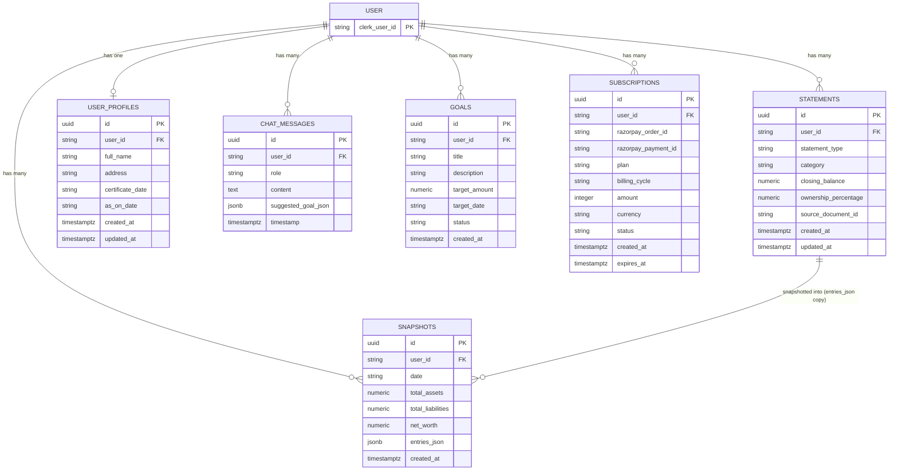

# Data Model

## Supabase Database

The database is **Supabase** (PostgreSQL). Configuration:
- **URL**: `NEXT_PUBLIC_SUPABASE_URL` environment variable
- **Public Key**: `NEXT_PUBLIC_SUPABASE_ANON_KEY` environment variable

Server-side access uses a Clerk-authenticated client via `lib/db.ts → getAuthenticatedClient()`. This function retrieves a Clerk JWT and passes it to Supabase as the `accessToken`, enabling Row-Level Security (RLS) based on the authenticated user's ID.

All tables have RLS enabled. Every query is automatically scoped to the authenticated `user_id` via policies that match `(auth.jwt() ->> 'sub') = user_id`.

---

### `statements` Table

Stores individual financial line items (assets and liabilities) for the net worth calculator.

| Column | Type | Constraints | Description |
|---|---|---|---|
| `id` | UUID | PRIMARY KEY | UUID |
| `user_id` | TEXT | NOT NULL | Clerk user ID (row-level isolation) |
| `statement_type` | TEXT | NOT NULL | E.g., "Savings Bank Account", "Home Loan" |
| `description` | TEXT | DEFAULT '' | E.g., "HDFC Bank A/c 1234" |
| `category` | TEXT | NOT NULL, CHECK IN ('asset','liability') | Asset or liability |
| `closing_balance` | NUMERIC | NOT NULL, CHECK >= 0 | Current balance (always positive) |
| `ownership_percentage` | NUMERIC | NOT NULL, CHECK 1–100 | User's ownership share |
| `source_document_id` | TEXT | nullable | Links to uploaded document (if AI-extracted) |
| `created_at` | TIMESTAMPTZ | NOT NULL, DEFAULT now() | ISO 8601 timestamp |
| `updated_at` | TIMESTAMPTZ | NOT NULL, DEFAULT now() | ISO 8601 timestamp |

**Index**: `idx_statements_user` on `(user_id)`

---

### `snapshots` Table

Point-in-time balance sheet snapshots. Each snapshot captures totals and the full list of entries as a JSON blob.

| Column | Type | Constraints | Description |
|---|---|---|---|
| `id` | UUID | PRIMARY KEY | UUID |
| `user_id` | TEXT | NOT NULL | Clerk user ID |
| `date` | TEXT | NOT NULL | Snapshot date (YYYY-MM-DD) |
| `total_assets` | NUMERIC | NOT NULL | Sum of effective asset values |
| `total_liabilities` | NUMERIC | NOT NULL | Sum of effective liability values |
| `net_worth` | NUMERIC | NOT NULL | total_assets − total_liabilities |
| `entries_json` | JSONB | NOT NULL | JSON array of `StatementEntry[]` at time of snapshot |
| `created_at` | TIMESTAMPTZ | NOT NULL, DEFAULT now() | ISO 8601 timestamp |

**Unique Index**: `idx_snapshots_user_date` on `(user_id, date)` — enforces one snapshot per user per date (upsert behavior)

---

### `subscriptions` Table

Records Razorpay payment subscriptions.

| Column | Type | Constraints | Description |
|---|---|---|---|
| `id` | UUID | PRIMARY KEY | UUID |
| `user_id` | TEXT | NOT NULL | Clerk user ID |
| `razorpay_order_id` | TEXT | NOT NULL | Razorpay order ID |
| `razorpay_payment_id` | TEXT | NOT NULL | Razorpay payment ID |
| `plan` | TEXT | NOT NULL | Plan ID: "professional" or "enterprise" |
| `billing_cycle` | TEXT | NOT NULL | "monthly" or "yearly" |
| `amount` | INTEGER | NOT NULL | Amount in paise (e.g., 25000 = ₹250) |
| `currency` | TEXT | NOT NULL, DEFAULT 'INR' | Currency code |
| `status` | TEXT | NOT NULL, DEFAULT 'active' | Subscription status |
| `created_at` | TIMESTAMPTZ | NOT NULL, DEFAULT now() | ISO 8601 timestamp |
| `expires_at` | TIMESTAMPTZ | NOT NULL | Subscription expiry timestamp |

**Index**: `idx_subscriptions_user` on `(user_id)`

**Active subscription query**: `WHERE user_id = ? AND status = 'active' AND expires_at > NOW() ORDER BY created_at DESC LIMIT 1`

---

### `user_profiles` Table

User profile data for net worth certificates and account management.

| Column | Type | Constraints | Description |
|---|---|---|---|
| `id` | UUID | PRIMARY KEY | UUID |
| `user_id` | TEXT | NOT NULL, UNIQUE | Clerk user ID (one profile per user) |
| `full_name` | TEXT | nullable | User's full name for PDF certificate |
| `address` | TEXT | nullable | User's address for PDF certificate |
| `certificate_date` | TEXT | nullable | Date shown on certificate header |
| `as_on_date` | TEXT | nullable | "As on" date for the balance sheet |
| `created_at` | TIMESTAMPTZ | NOT NULL, DEFAULT now() | ISO 8601 timestamp |
| `updated_at` | TIMESTAMPTZ | NOT NULL, DEFAULT now() | ISO 8601 timestamp |

---

### `chat_messages` Table

Stores user and AI advisor messages from the financial chat interface. The AI can embed structured financial goals in response text, which are parsed client-side.

| Column | Type | Constraints | Description |
|---|---|---|---|
| `id` | UUID | PRIMARY KEY | UUID |
| `user_id` | TEXT | NOT NULL | Clerk user ID |
| `role` | TEXT | NOT NULL | Message role: `"user"` or `"assistant"` |
| `content` | TEXT | NOT NULL | Message text |
| `timestamp` | TIMESTAMPTZ | NOT NULL, DEFAULT now() | ISO 8601 timestamp |
| `suggested_goal_json` | JSONB | nullable | Extracted financial goal from AI response |

---

### `goals` Table

Financial goals created by the user, either suggested by the AI advisor or added manually.

| Column | Type | Constraints | Description |
|---|---|---|---|
| `id` | UUID | PRIMARY KEY | UUID |
| `user_id` | TEXT | NOT NULL | Clerk user ID |
| `title` | TEXT | NOT NULL | Goal title |
| `description` | TEXT | nullable | Goal description |
| `target_amount` | NUMERIC | nullable | Target amount in rupees |
| `target_date` | TEXT | nullable | Target date (YYYY-MM-DD) |
| `status` | TEXT | NOT NULL, DEFAULT 'active' | Goal status: `"active"`, `"completed"`, or `"paused"` |
| `created_at` | TIMESTAMPTZ | NOT NULL, DEFAULT now() | ISO 8601 timestamp |

---

## TypeScript Types

All shared types are defined in `app/src/types/index.ts`.

### Core Entities

#### `StatementEntry`

```typescript
interface StatementEntry {
  id: string;
  statementType: string;        // e.g., "Savings Bank Account"
  description: string;           // e.g., "HDFC Bank A/c 1234"
  category: "asset" | "liability";
  closingBalance: number;        // always positive
  ownershipPercentage: number;   // 1–100
  sourceDocumentId?: string;     // UUID of uploaded document
}
```

#### `UserProfile`

```typescript
interface UserProfile {
  fullName: string;
  address: string;
  certificateDate: string;       // date for the certificate header
  asOnDate: string;              // "as on" date for the balance sheet
}
```

#### `NetWorthSnapshot`

```typescript
interface NetWorthSnapshot {
  id: string;
  date: string;                  // YYYY-MM-DD
  totalAssets: number;
  totalLiabilities: number;
  netWorth: number;
  entries: StatementEntry[];     // full entries at time of snapshot
  createdAt: string;             // ISO 8601
}
```

#### `FinancialGoal`

```typescript
interface FinancialGoal {
  id: string;
  title: string;
  description: string;
  targetAmount?: number;
  targetDate?: string;
  createdAt: string;             // ISO 8601
  status: "active" | "completed" | "paused";
}
```

#### `ChatMessage`

```typescript
interface ChatMessage {
  id: string;
  role: "user" | "assistant";
  content: string;
  timestamp: string;             // ISO 8601
  suggestedGoal?: {              // extracted from AI response
    title: string;
    description: string;
    targetAmount?: number;
    targetDate?: string;
  };
}
```

#### `ExtractedEntry`

```typescript
interface ExtractedEntry {
  statementType: string;
  description: string;
  category: "asset" | "liability";
  closingBalance: number;
}
```

#### `UploadedDocument`

```typescript
interface UploadedDocument {
  id: string;
  originalName: string;
  storedPath: string;            // filename on disk
  fileType: string;              // MIME type
  size: number;                  // bytes
  uploadedAt: string;            // ISO 8601
}
```

### Analytics & Insights

#### `InsightItem`, `InsightResult`

```typescript
type InsightDomain = "growth" | "leverage" | "liquidity" | "efficiency" | "risk" | "behavior" 
                    | "inflation_audit" | "gap_analysis" | "debt_quality" | "tax_efficiency" 
                    | "trajectory" | "protection";
type InsightSeverity = "critical" | "warning" | "info" | "unavailable";
type InsightTrend = "up" | "down" | "neutral";

interface InsightItem {
  id: string;
  domain: InsightDomain;
  title: string;
  description: string;
  severity: InsightSeverity;
  trend?: InsightTrend;
  metricValue?: number;
  metricLabel?: string;
  unavailable?: boolean;
  unavailableReason?: string;
}

interface InsightResult {
  summary: { total: number; critical: number; warnings: number; info: number };
  domains: Record<InsightDomain, InsightItem[]>;
  advancedResults: AdvancedDimensionResults;
  computedAt: string;
}
```

#### `AdvancedInputs`

Supplementary financial data collected via optional form. Stored in localStorage (`wealthtrek_advanced_inputs`); never persisted to Supabase. Used by analytics to compute deeper insights (inflation audit, debt quality, tax efficiency, trajectory, protection).

```typescript
interface AdvancedInputs {
  monthly_income?: number;
  monthly_emi_total?: number;
  monthly_investment?: number;
  current_age?: number;
  retirement_age?: number;
  existing_term_cover?: number;
  existing_health_cover?: number;
  ppf_annual_contribution?: number;
  vpf_contribution?: number;
  monthly_sip_amount?: number;
  has_will_created?: boolean;
  has_international_funds?: boolean;
}
```

#### `BalanceSheet`

Transient type; parsed from snapshot entries at computation time.

```typescript
interface BalanceSheet {
  assets: Record<string, number>;
  liabilities: Record<string, number>;
  total_assets: number;
  total_liabilities: number;
}
```

### Advanced Dimension Results

These types represent the output of the 12-domain insight computation (`computeAllInsights()`). None are persisted to Supabase.

#### `InflationAuditResult`

```typescript
interface InflationAuditAsset {
  key: string;
  label: string;
  balance: number;
  nominal_return: number;
  real_return: number;
  status: "red" | "amber" | "green";
}

interface InflationAuditResult {
  per_asset: InflationAuditAsset[];
  sub_inflation_pct: number;
  sub_inflation_value: number;
  overall_flag: "ok" | "warn" | "alert";
  primary_alert: string;
}
```

#### `GapAnalysisResult`

```typescript
interface GapBucket {
  id: string;
  label: string;
  status: "ok" | "over" | "miss" | "nudge" | "info";
  current_pct: number;
  message: string;
}

interface GapAnalysisResult {
  buckets: GapBucket[];
  gap_count: number;
  over_count: number;
  summary: string;
}
```

#### `DebtQualityResult`

```typescript
interface DebtBreakdownItem {
  name: string;
  amount: number;
  type: "productive" | "consumptive";
  effective_rate_note: string;
}

interface DebtQualityResult {
  productive_total: number;
  consumptive_total: number;
  productive_pct: number;
  consumptive_pct: number;
  pdr: number;
  status: "green" | "amber" | "red";
  credit_card_flag: boolean;
  breakdown: DebtBreakdownItem[];
  primary_alert: string;
  secondary_alert: string | null;
}
```

#### `TaxEfficiencyResult`

```typescript
interface TaxCheck {
  id: string;
  label: string;
  passed: boolean;
  message: string;
}

interface TaxEfficiencyResult {
  checks: TaxCheck[];
  score: number;
  score_pct: number;
  grade: "A" | "B" | "C" | "D";
  top_action: string;
}
```

#### `TrajectoryResult`

```typescript
interface ProjectionScenario {
  rate: number;
  corpus: number;
  vs_target_pct: number;
}

interface TrajectoryResult {
  current_net_worth: number;
  investable_net_worth: number;
  years_to_retirement: number;
  monthly_surplus: number;
  blended_return: number;
  projections: {
    conservative: ProjectionScenario;
    base: ProjectionScenario;
    optimistic: ProjectionScenario;
  };
  target_corpus: number;
  on_track: boolean;
  gap_amount: number;
  gap_monthly_sip: number;
  primary_alert: string;
}
```

#### `ProtectionResult`

```typescript
interface ProtectionResult {
  total_liabilities: number;
  annual_income: number;
  recommended_term_cover: number;
  existing_term_cover: number | null;
  term_cover_gap: number | null;
  coverage_pct: number | null;
  term_status: "adequate" | "low" | "gap" | "not_entered";
  health_status: "adequate" | "low" | "not_entered";
  alerts: string[];
}
```

#### `AdvancedDimensionResults`

```typescript
interface AdvancedDimensionResults {
  inflationAudit?: InflationAuditResult;
  gapAnalysis?: GapAnalysisResult;
  debtQuality?: DebtQualityResult;
  taxEfficiency?: TaxEfficiencyResult;
  trajectory?: TrajectoryResult;
  protection?: ProtectionResult;
}
```

### Wealth Journey System

Computed on-demand by `POST /api/wealth/journey`; never persisted.

```typescript
type WealthStage = "foundation" | "stability" | "acceleration" | "optimization" | "preservation";

interface StageConfig {
  id: WealthStage;
  label: string;
  range: [number, number];
  color: string;
  mindset: string;
  goal: string;
  stageIndex: number;
  scoreLabel: string;
}

type ChecklistCategory = "protection" | "growth" | "behavior" | "tax" | "diversification";
type ChecklistStatus = "done" | "partial" | "todo" | "not_applicable";

interface ChecklistItemDef {
  id: string;
  stage: WealthStage;
  label: string;
  category: ChecklistCategory;
  weight: number;
}

interface ChecklistResult {
  id: string;
  label: string;
  category: ChecklistCategory;
  weight: number;
  status: ChecklistStatus;
  score: number;
  message: string;
  actionHint?: string;
}

interface ChecklistContext {
  netWorth: number;
  stage: WealthStage;
  balanceSheet: BalanceSheet;
  advancedInputs?: AdvancedInputs;
  insightResult: InsightResult;
  snapshots: NetWorthSnapshot[];
}

interface StageHistoryEntry {
  date: string;
  stage: WealthStage;
  score: number;
}

interface JourneyResult {
  stage: StageConfig | null;
  previousStage?: StageConfig;
  transitioned: boolean;
  progress: number;
  checklist: ChecklistResult[];
  score: { value: number; label: string; insufficientData: boolean };
  stageHistory: StageHistoryEntry[];
}
```

### `STATEMENT_TYPE_PRESETS`

A constant array of preset statement types used in the `StatementForm` dropdown. 20 presets across 2 categories:

| Label | Category |
|---|---|
| Savings Bank Account | asset |
| Fixed Deposit | asset |
| PPF | asset |
| Provident Fund | asset |
| Mutual Fund | asset |
| Stock Holdings | asset |
| Real Estate | asset |
| Self-Occupied Home | asset |
| Gold/Jewellery | asset |
| Silver | asset |
| Other Asset | asset |
| Home Loan | liability |
| Mortgage Loan | liability |
| Personal Loan | liability |
| Top-up Loan | liability |
| Car Loan | liability |
| Bike Loan | liability |
| Credit Card Outstanding | liability |
| Education Loan | liability |
| Other Liability | liability |

---

## localStorage Keys

Some data is stored client-side in `localStorage`, managed by custom React hooks. Most keys have server-backed API endpoints, but the hooks have not yet been migrated to use them. The one-time migration utility `utils/migrateLocalStorageToDb.ts` handles data transfer from localStorage to Supabase.

| localStorage Key | Hook | Shape | Storage | API Backed | Migration Status |
|---|---|---|---|---|---|
| `nwc_profile` | `useUserProfile` | `UserProfile` | localStorage | Yes (`/api/profile`) | Migration utility exists; hook not yet updated |
| `financial-chat-history` | `useChatHistory` | `ChatMessage[]` | localStorage | Yes (`/api/chat/messages`) | Migration utility exists; hook not yet updated |
| `financial-goals` | `useFinancialGoals` | `FinancialGoal[]` | localStorage | Yes (`/api/goals`) | Migration utility exists; hook not yet updated |
| `wealthtrek_advanced_inputs` | `useAdvancedInputs` | `AdvancedInputs` | localStorage | No | No server endpoint planned |
| `nwc_documents` | `useDocuments` | `UploadedDocument[]` | localStorage | Partial (files on disk at `/api/documents/upload`, metadata in localStorage) | No server table; files stored on disk, metadata not persisted |

> **Note**: Clearing browser storage (Settings → Privacy → Clear browsing data) removes all localStorage keys, including unsync'd goals and chat history. The `MigrationRunner` component (visible in app init) handles one-time transfer to Supabase on first load.

---

## Entity Relationships



**Key design notes**:
- **Snapshot immutability**: Snapshots store a **copy** of all statement entries at creation time (`entries_json`). Subsequent edits or deletions to statements do not affect historical snapshots. Each snapshot is a frozen-in-time balance sheet.
- **Row-Level Security**: All tables have RLS enabled. Supabase policies restrict access so that users can only query rows where `(auth.jwt() ->> 'sub') = user_id`.
- **localStorage bridge**: The three table (`user_profiles`, `chat_messages`, `goals`) have server-backed tables **and** corresponding localStorage storage. The migration utility transfers data one-time; the hooks still read from localStorage by default (architecture debt in progress).
